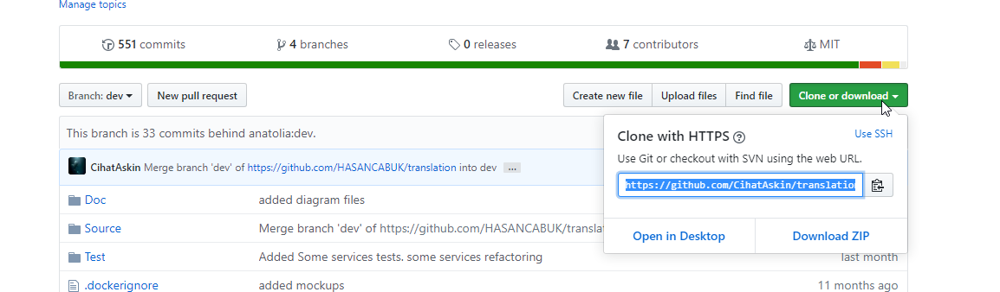
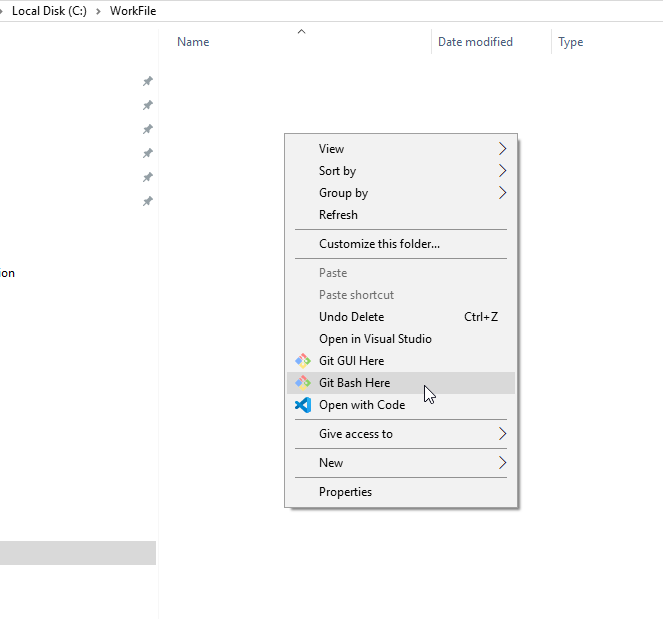
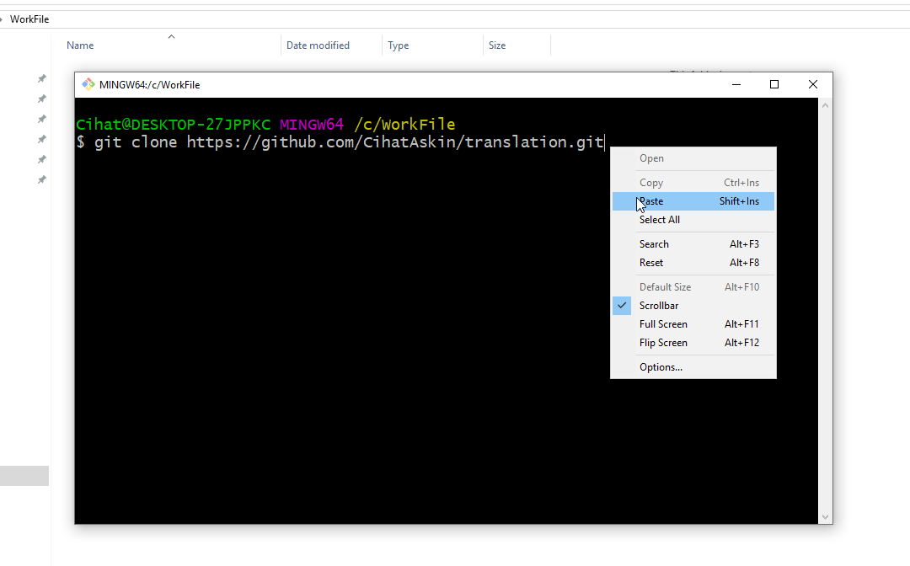
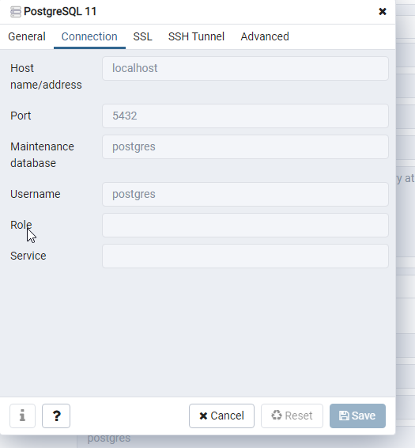
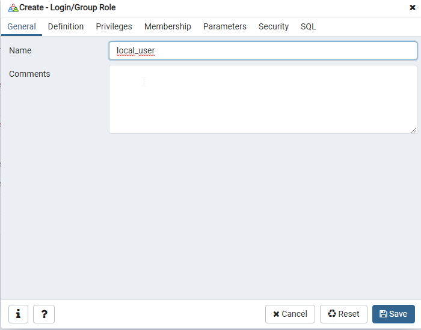
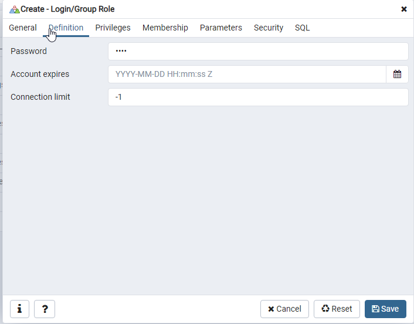
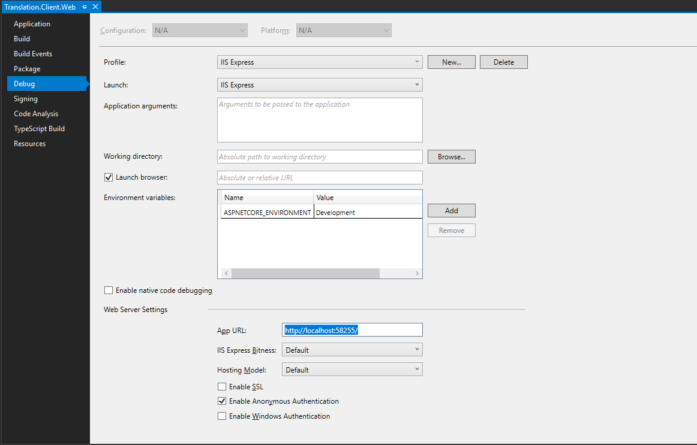
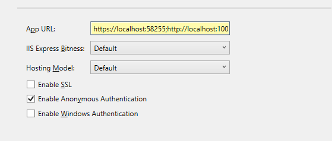
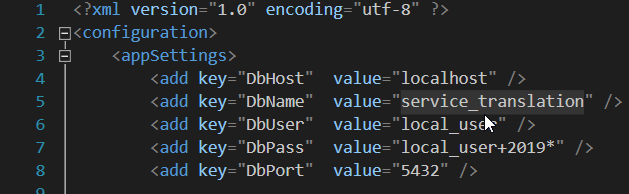

# Translation
## Introduction
1. Presentation  
2. Installs  
3. Cloning Project  
4. DataBase Setup  
5. Last Settings  
6. Naming Conventions and Terminology
## Presentation
Translation is a project that writed with c#. We kept to Patterns of Enterprice Application Architecture on this project. ...
## Installs for Windows Envinroment
1. Visual Studio  2019 Community - https://visualstudio.microsoft.com (required)
>
>* Choose ASP.NET and wep development in VS Workloads during installation
>* Choose .NET Core cross-platform development in VS Workloads during installation  
>  
2. [Git](https://git-scm.com/downloads) (required)  
3. [Web Compiler](https://marketplace.visualstudio.com/items?itemName=MadsKristensen.WebCompiler)
4. [Bundler & Minifier](https://marketplace.visualstudio.com/items?itemName=MadsKristensen.BundlerMinifier) (required)  
5. [PgAdmin 4](https://www.pgadmin.org/download/pgadmin-4-windows/) (required)
6. [PostgreSQL](https://www.postgresql.org/download/) (required)  
7. [WinMerge](https://winmerge.org/)
8. [ReSharper](https://www.jetbrains.com/resharper/]) and [JetBrains account](https://account.jetbrains.com)
9. [GitKraken](https://www.gitkraken.com) or other git app  
## Cloning Project  
1. After Git installed create a [Github](https://github.com) account.  
2. Create a file on your PC to cloning the project  
3. Fork project to your account from [here](https://github.com/anatolia/translation)  
  
  

4. Clone the project address from your github repository  
  
  
  
5. Open your file that created before, and right click inside the file to open the **Git Bash**    
  
  

6. Write **git clone** and paste the project address that had copied before on Git Bash Command Line  
  
  
  
  
  
## DataBase Setup  
1. After PostgreSQL and PgAdmin have setuped exe files enter PgAdmin.  
2. Right click the **Servers** and go to "Create" to "Server".  
  
  
  
3. Give a name for your server on **General** tab.  
  
4. Enter Host name: "localhost", Port:"5432", Maintenance database: "postgres", Username: "postgres" on **Connection** tab.  
  
  
  
5. Save your server infos.  
  
6. Right click the **Login/Group** and go to "Create" to "Login/Group Role".  
  
  
  
7. Enter Name: "local_user" on **General** tab  
  
  
  
8. Enter Password: "local_user+2019*" on **Definition** tab.  
  
  
  
9. Select "Yes" for "Can login?" and "Superuser?" on **Privileges** tab.  
  
  
  
10. Save Login/Group Role infos.  
  
## Last Settings
1. Open project in Visual Studio  
  
  
  
2. Right Click to **Translation.Client.Web** and go to **Properties** at bottom  
  
  
  
3. Select **Debug** to edit **App URL:**  
  
  
  
4. We need to some changes to be able to **Log In** in Translation Project  

>* First, change http to https and delete last char **'/'** and  add **";"**.  
  
>* Second, paste "http://localhost:10005" end of your URL  
  
>* At last **https://localhost:14435;http://localhost:10005**  
  
  

5. Match your DataBase infos in your App.config file under the Translation.Client.Web  
  
  
  
## Naming Conventions and Terminology  
We built this project as enterprise application architecture. 
Using patterns in project was described for you can comprehend as soon as possible. 
Translaion project is consist of four main part.  
1. Client
2. Server 
3. Common
4. Test

### Client  
Client side was designed with MVC(**Model**-**View**-**Controller**) pattern. 
In addition to this  we added **Helpers** part that includes out of MVC to describe other function in Enterprise Architecture.  
  
1. #### Models (view models)  
   Models contain data using for transfering between controller and view components. 
   This data is isolated from other components and logic transactions.
   
2. #### Views  
   Views contain all UI(User Interface) logic of application to present data to the user.  

3. #### Controllers  
   Controllers contain complex logic to process all the business logic 
   to manipulate data using Models and interact with the Views to render the output.   

4. #### Mappers  
   Mappers create a **Model** that required to View using **Response** came from **Server** side in **Controller**.  
   It is a insulating layer between **Server** and **Client**.  

### Common  
This folder contains files used by both side(Client and Server) for communication.  

1. #### Data Transfer Object (DTO)  
   DTO is a model that restrains to carry needless data to Server from Client. It is used as a part of **Response**.
   We use DTO not to send all data in **Model**.
   
2. #### Requests  
   **Request** is a model that using for send Client's requests to Server side.

3. #### Responses  
   **Response** is a model that using for send Server's response to Client side.  
   
4. #### Service Interface  
   This interfaces uses in controllers with dependency injection to send request to Server and to get Response from Server.  
   
### Server  
Server consist of components that work with Data Base(DB).   

1. #### Entities (domain Models)  
    These models creates Data Base. All information came from **Client** is saved as entity to DB.  
    
2. #### Factories  
   Factory is a mapper that using to moves data between objects and DB.It convert **Request** that came from Client to entity.  
   
3.  #### Repositories  
   Repository is layer that ensure to mediates between DB and **Server**. It allow us to operation without using SQL command.  

4.  #### Unit of Work  
   Unit of Work maintains a list of objects affected by a business transaction and coordinates the writing out of changes and the resolution of concurrency problems  
  
5. #### Services  
   Every service has a set fo operation that ensure response  to own controller.it is a layer that doing DB transaction.

 
